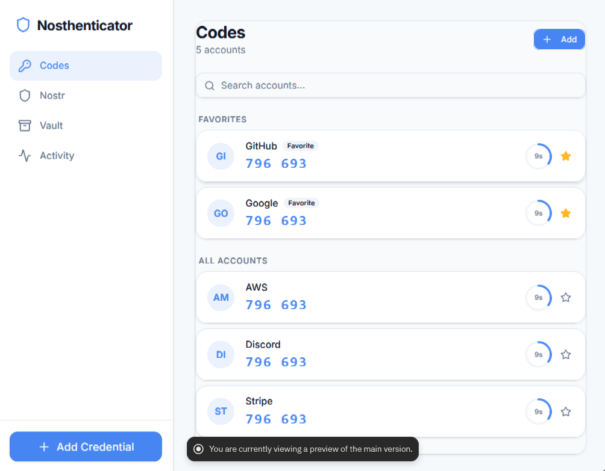

# Nosthenticator

<p align="center">
  
</p>

## Overview

Nosthenticator is a Nostr-native signing device companion — the **“Coldcard of Nostr identities.”**  

It provides hardware-class signing security with explicit confirmation required for every operation, a clean multi-account authenticator interface, and an append-only cryptographic audit log.

Nosthenticator is designed to operate in dual modes:
- **Standard Authenticator** (TOTP-style codes)
- **Nostr Signer** (npub-based identity + signing authority)

The goal is to unify authentication and decentralized identity into a single, secure, user-controlled interface.

---

## Stack

- **Monorepo tool**: pnpm workspaces  
- **Node.js version**: 24  
- **Package manager**: pnpm  
- **TypeScript version**: 5.9  

### Frontend
- React + Vite  
- Tailwind CSS  
- shadcn/ui  
- Recharts  
- Wouter  

### Backend
- Express 5  

### Data Layer
- PostgreSQL  
- Drizzle ORM  

### Validation & API
- Zod (`zod/v4`)  
- drizzle-zod  
- Orval (OpenAPI → client generation)  

### Build
- esbuild (CJS bundle)  

---

## Architecture

```
artifacts/
  nosthenticator/   — React + Vite frontend (clean, minimal, security-first UI)
  api-server/       — Express 5 REST API

lib/
  db/               — PostgreSQL schema via Drizzle ORM
  api-spec/         — OpenAPI spec (source of truth)
  api-client-react/ — Generated React Query hooks
  api-zod/          — Generated Zod validation schemas
```

---

## Features

- **Codes Dashboard**
  - Multi-account TOTP-style codes
  - Favorites + quick access
  - Clean, glanceable UX with countdown timers

- **Nostr Identities (Planned / In Progress)**
  - npub identity management
  - Signing request handling (NIP-46 style)
  - Separation between identity and signing authority

- **Pending Authorizations**
  - Live queue of signing requests
  - Hex event preview before approval
  - One-click approve / reject

- **Audit Log**
  - Append-only, hash-chained log
  - Tamper-evident signing history
  - Full traceability of identity actions

- **Vault**
  - Secure storage boundary for keys and credentials
  - Designed for future hardware / enclave integration

- **Activity**
  - Timeline of authentication + signing events
  - Visibility into system behavior and usage

---

## Database Tables

- `nostr_keys` — Stored npub identities  
- `signing_requests` — Pending + completed signing requests  
- `audit_log` — Hash-chained signing history  
- `totp_accounts` — Authenticator accounts (codes + metadata) *(planned/optional)*  

---

## Key Commands

- `pnpm run typecheck`  
  → Full typecheck across all packages  

- `pnpm run build`  
  → Typecheck + build all packages  

- `pnpm --filter @workspace/api-spec run codegen`  
  → Regenerate API hooks + Zod schemas from OpenAPI spec  

- `pnpm --filter @workspace/db run push`  
  → Push DB schema changes (dev only)  

- `pnpm --filter @workspace/api-server run dev`  
  → Run API server locally  

---

## Design Principles

- **Identity-first, not account-first**
  - No unnecessary profiles or metadata
  - npub is the identity layer

- **Explicit user control**
  - Every signing operation requires confirmation
  - No silent background signing

- **Security over convenience**
  - Clear trust boundaries
  - Designed for air-gap workflows (QR support planned)

- **Auditability by default**
  - Append-only log
  - Hash-chain integrity
  - No hidden actions

- **Composable future**
  - Nostr-native authentication layer
  - Expandable into secure messaging, identity, and authorization flows

---

## Roadmap (High-Level)

- NIP-46 remote signer support  
- QR-based air-gap transport  
- iCloud / encrypted backup (optional, user-controlled)  
- Multi-device trust model  
- Hardware enclave / secure element integration  
- Advanced policy controls for signing  

---

## Notes

Nosthenticator intentionally starts minimal:
- Key storage  
- Code generation  
- Signing confirmation  
- Audit logging  

Everything else is layered on top — never assumed, never hidden.

---

See the `pnpm-workspace` skill for workspace structure, TypeScript setup, and package details.
